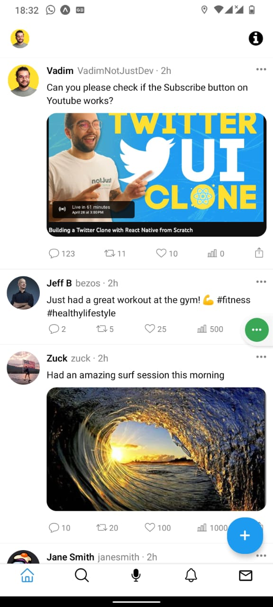

# Twitter Clone

## 📸 Screenshots

| Home Screen                               | Home Screen                                   | Settings Screen                               |
| ----------------------------------------- | --------------------------------------------- | --------------------------------------------- |
|  |  |  |

## 📝 Description

Twitter Clone is a web application that allows users to post messages to a public stream. Users can also follow other users to see their posts in their own stream.

## 🚀 How to use

```sh

git clone

npm install

npm start

```

## Technologies Used

- React Native
- Expo
- Expo Vector Icons
- Expo Router
- TypeScript

## 📝 Notes

Use [`expo-router`](https://expo.github.io/router) to build native navigation using files in the `app/` directory.

## 🚀 How to create a react native project with router as default

```sh
npx create-expo-app -e with-router
```

## 📝 Expo App Services

Note: 📌 [expo.io documentation](https://docs.expo.dev/build/introduction/)

### 📂 EAS Build

- First have to login into your expo account

```sh
$ eas login
```

- Then have to configure your project

```sh
$ eas build:configure
```

- Then have to build your project for android or ios

```sh
$ eas build --platform android
```

```sh
$ eas build --platform ios
```

### 📝 EAS Build and Submit

- configure your eas.json file to build .apk file

```json
{
  "apkbuild": {
    "android": {
      "buildType": "apk"
    }
  }
}
```

- Then have to build your project for android or ios

```sh
$ eas build -p all --profile preview
```
